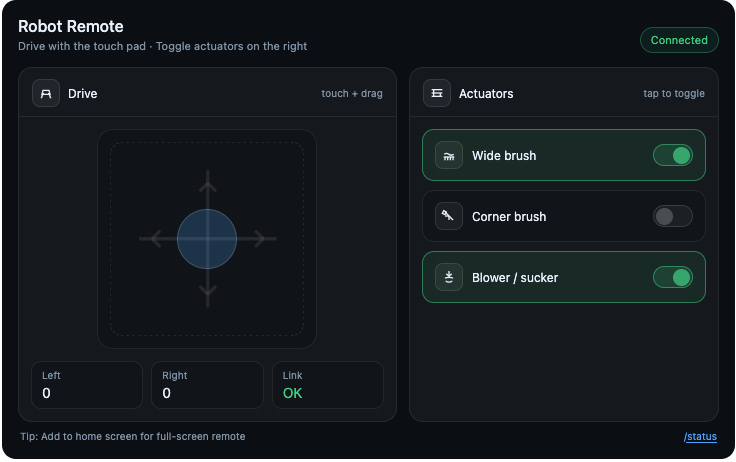

# picoControl-wifi

WiFi-based remote control firmware for the Raspberry Pi Pico W, built for a Tchibo vacuum cleaner robot (first-generation Roomba-compatible platform) repurposed as an autonomous drawing tool. The robot is driven over a field dusted with coffee powder, using its brushes and blower to draw patterns and lines.

---

## What it does

The Pico W acts as a self-contained WiFi access point. Any phone, tablet, or laptop can connect directly to the robot — no router, no internet, no app install required. Opening a browser is enough. A joystick-style touch interface lets you drive the robot and toggle its cleaning actuators independently.

The firmware controls:

- **Left and right drive motors** — differential steering via cross-mix
- **Wide brush** — the main rotating floor brush (PWM speed control)
- **Corner brush** — the side sweeper brush (on/off)
- **Blower / sucker** — the vacuum motor (on/off)

---

## Hardware

| Component | Details |
|---|---|
| MCU | Raspberry Pi Pico W |
| Board | picoControl v3.5 |
| Left motor | pins 21 (A), 22 (B), 26 (PWM) |
| Right motor | pins 18 (A), 19 (B), 20 (PWM) |
| Wide brush | pin 14 (PWM, active high) |
| Corner brush | pin 15 (enable, active low) |
| Blower | pin 10 (active high), pin 11 (enable, active low) |
| Display | SSD1306 OLED 128×32 on I2C (optional) |

Motor driver type: sign-magnitude PWM (Electromen-style H-bridge or equivalent).

---

## WiFi setup

### Access point mode

The Pico W creates its own WiFi network — no external router needed. This keeps latency low and avoids any dependency on existing infrastructure.

| Setting | Value |
|---|---|
| SSID | `VacuumBot` |
| Password | `12345678` |
| AP IP address | `192.168.42.1` |
| Channel | 6 |

Connect your phone or laptop to the `VacuumBot` network. Most devices will show a captive portal notification and open the control page automatically. If not, open a browser and navigate to `http://192.168.42.1`.

**QR code payload** (for a sticker on the robot):
```
WIFI:T:WPA;S:VacuumBot;P:12345678;H:false;;
```

### Captive portal

The firmware includes a DNS server that catches all domain lookups and redirects them to the control page. This triggers the automatic "sign in to network" popup on Android, iOS, and Windows — so users land on the remote without having to type an address.

Probe paths handled: `/generate_204`, `/gen_204`, `/hotspot-detect.html`, `/ncsi.txt`, `/connecttest.txt`, `/redirect`, `/success.txt`, `/fwlink`, `/wpad.dat`.



---

## Control interface

The web interface (rendered above) is embedded directly in the firmware flash as a PROGMEM byte array — no SD card or filesystem required. It is served over plain HTTP from the Pico's WiFi stack.

### Drive pad

A circular touch pad with a draggable knob. Dragging up drives forward, down reverses, left/right turns. The knob position is mixed into left/right motor values using a cross-mix algorithm that scales turning rate with forward speed. Commands are sent to `/api` at up to 25 Hz while the knob is held.

Releasing the knob sends a stop command immediately.

### Actuator toggles

Three toggle buttons control the brushes and blower independently. State is reflected visually (green highlight + switch position). The firmware enforces a configurable maximum on-time for each actuator as a safety measure.

### Status endpoint

`GET /status` returns a JSON object with the current state:

```json
{
  "left": 180,
  "right": 120,
  "wide": true,
  "corner": false,
  "blower": true,
  "inUse": true,
  "ownerId": 3232246274
}
```

---

## Single-user ownership

Only one device can drive the robot at a time. The first device to send a `/api` request becomes the *owner* and holds an exclusive lease. Other devices connecting to the network see a "Remote is in use" page and are automatically refreshed every 2 seconds.

The lease expires after **10 seconds** of inactivity (no `/api` calls). At that point any device can take control. This means if the controlling phone loses WiFi or the user walks away, the robot becomes available again without a manual reset.

---

## Safety timers

| Condition | Action |
|---|---|
| No `/api` calls for 30 s | Motors stop (drive commands zeroed) |
| No activity for 2 min | AP and DNS restarted, owner released |
| Actuator on for > 10 s | Actuator automatically switched off |
| Owner lease > 10 s since last `/api` | Ownership released |

These are all configurable in `WIFIremote::Config` inside `main.cpp`.

---

## OLED display

If a 128×32 SSD1306 OLED is fitted, it shows:

- AP IP address
- Connected owner's IP (or "no connection")
- "getting data" indicator when `/api` is being called
- Left/right motor level bars
- Actuator state dots (wide brush, corner brush, blower)

---

## Project structure

```
picoControl-wifi/
├── platformio.ini          # PlatformIO config (rpipicow, earlephilhower core)
├── include/
│   ├── config.h            # Feature flags and pin assignments
│   ├── WIFIremote.h        # WiFi server class declaration
│   ├── Motor.h             # DC motor driver class
│   └── PicoRelay.h         # Relay/PWM expander (unused in this build)
└── src/
    ├── main.cpp            # Setup, loop, motor control, OLED
    ├── config.cpp          # Motor object definitions (board v3.5 pins)
    ├── WIFIremote.cpp      # AP, DNS, HTTP server, embedded HTML
    ├── Motor.cpp           # Motor and cross-mix implementation
    └── PicoRelay.cpp       # Relay board driver (linked but not active)
```

---

## Building

Requires PlatformIO with the earlephilhower Arduino-Pico core.

```bash
pio run -e picow          # build
pio run -e picow -t upload  # flash
```

The `platformio.ini` targets `rpipicow` (the Pico W with CYW43 WiFi). Using plain `pico` will fail — that board has no WiFi silicon.

Library dependencies (fetched automatically by PlatformIO):

- `adafruit/Adafruit SSD1306`
- `adafruit/Adafruit GFX Library`
- `robtillaart/PCA9635`

---

## Configuration

Edit the `WIFIremote::Config` block in `main.cpp` to change network name, password, IP address, or timeouts:

```cpp
WIFIremote::Config cfg;
cfg.ssid             = "VacuumBot";
cfg.pass             = "12345678";
cfg.apIP             = IPAddress(192, 168, 42, 1);
cfg.ownerLeaseMs     = 10000;   // 10 s
cfg.motorIdleMs      = 30000;   // 30 s
cfg.disconnectIdleMs = 120000;  // 2 min
```

Motor pins are set in `config.cpp`. Brush and blower pins are set near the top of `setup()` in `main.cpp`.

---

## Origin

This firmware is a stripped-down branch of the larger **picoControl** project, which supports multiple robots using ELRS/CRSF radio links. This version removes all radio, animation, audio, and multi-vehicle support, keeping only what is needed for WiFi control of the vacuum robot.